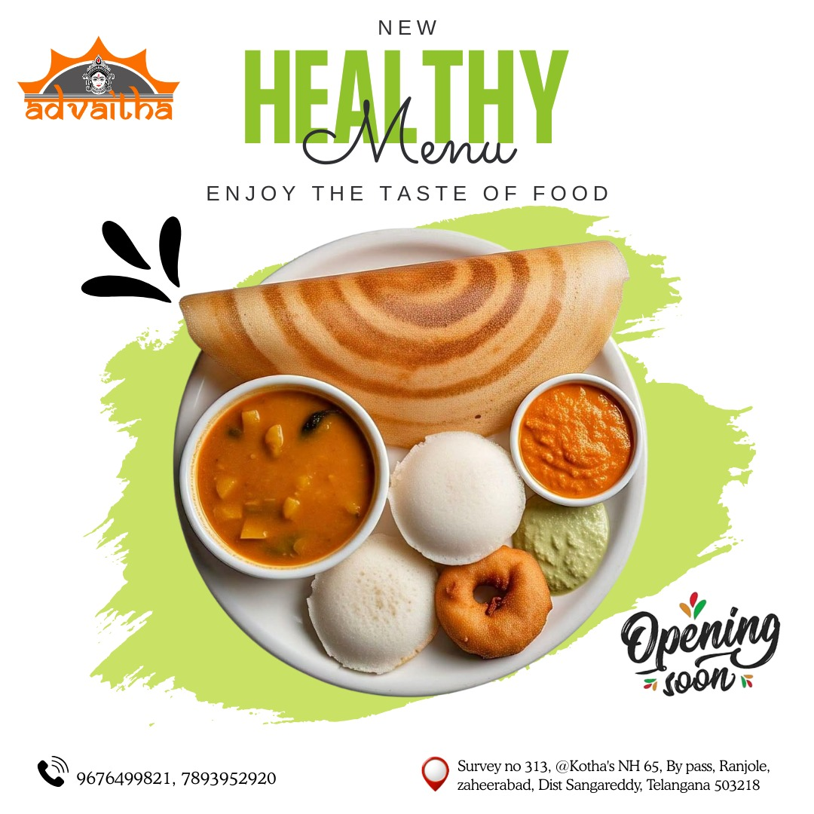

<!DOCTYPE html>
<html lang="en">
<head>
  <meta charset="UTF-8">
  <meta name="viewport" content="width=device-width, initial-scale=1.0">
  <title>Advaitha Kitchen</title>

  <!-- Bootstrap CSS -->
  <link href="https://cdn.jsdelivr.net/npm/bootstrap@5.3.3/dist/css/bootstrap.min.css" rel="stylesheet">
  <!-- Google Font: Rubik Distressed -->
  <link href="https://fonts.googleapis.com/css2?family=Rubik+Distressed&display=swap" rel="stylesheet">

  
</head>
<body>

  <!-- Navigation -->
  <nav class="navbar navbar-expand-lg navbar-dark bg-dark sticky-top">
    

      <a class="navbar-brand" href="#">Advaitha Kitchen</a>
      <button class="navbar-toggler" type="button" data-bs-toggle="collapse" data-bs-target="#navbarNav">
        
      </button>
      

        <ul class="navbar-nav ms-auto">
          <li class="nav-item"><a class="nav-link active" href="#home">Home</a></li>
          <li class="nav-item"><a class="nav-link" href="#menu">Menu</a></li>
          <li class="nav-item"><a class="nav-link" href="#specials">Specials</a></li>
          <li class="nav-item"><a class="nav-link" href="#contact">Contact</a></li>
        </ul>
      

    

  </nav>

  <!-- Alert -->
  

    

      🍽️ Welcome to <strong>Advaitha Kitchen</strong> — Serving Freshness & Flavor Every Day!
    

  

  <!-- Carousel -->
  

    

      

        
      

      

        
      

      

        
      

    

    <button class="carousel-control-prev" type="button" data-bs-target="#foodCarousel" data-bs-slide="prev">
      
    </button>
    <button class="carousel-control-next" type="button" data-bs-target="#foodCarousel" data-bs-slide="next">
      
    </button>
  

  <!-- Breadcrumb -->
  <nav class="container mt-4" aria-label="breadcrumb">
    <ol class="breadcrumb">
      <li class="breadcrumb-item"><a href="#home">Home</a></li>
      <li class="breadcrumb-item"><a href="#menu">Menu</a></li>
      <li class="breadcrumb-item active" aria-current="page">Today's Specials</li>
    </ol>
  </nav>

  <!-- Buttons & Button Group -->
  

    

      <button type="button" class="btn btn-primary" data-bs-toggle="modal" data-bs-target="#orderNowModal">Order Now</button>
      <button type="button" class="btn btn-success" data-bs-toggle="modal" data-bs-target="#bookTableModal">Book a Table</button>
      <button type="button" class="btn btn-danger" data-bs-toggle="modal" data-bs-target="#offersModal">Today's Offer</button>
    

  

  <!-- Menu Section -->
  

    <h2>Our Veg Menu</h2>
    South Indian
    North Indian
    Desserts
    

      

        

          

            <h5 class="card-title">South Indian Delights</h5>
            
Idli, Dosa, Vada, Upma, Pongal

          

        

      

      

        
 
        

            <h5 class="card-title">North Indian Tastes</h5>
            
Paneer Butter Masala, Dal Tadka, Roti, Biryani

          

        

      

      

        

          

            <h5 class="card-title">Sweet Desserts</h5>
            
Gulab Jamun, Rasmalai, Kheer, Jalebi

          

        

      

    

  

  <!-- Specials Section -->
  

    <h2>Today's Specials</h2>
    
Chef’s Choice for the Day

    <ul class="list-group">
      <li class="list-group-item">🌱 Veg Biryani with Raita</li>
      <li class="list-group-item">🥗 Paneer Tikka Masala</li>
      <li class="list-group-item">🍛 Vegetable Kurma with Parotta</li>
    </ul>
  

  <!-- Contact Section -->
  

    <h2 class="text-center">Contact Us</h2>
    
📍 Hyderabad, India | ☎️ +91 9876543210 | ✉️ info@advaithakitchen.com

  

  <!-- Footer -->
  <footer>
    
&copy; 2025 Advaitha Kitchen | Taste the Tradition, Love the Flavor ❤️

  </footer>

  <!-- Order Now Modal -->

  

    

      

        <h5 class="modal-title">Veg Menu - Order Now</h5>
        <button type="button" class="btn-close" data-bs-dismiss="modal"></button>
      

      

        
        <!-- Menu -->
        

          <button class="btn btn-outline-primary w-100 mb-2" onclick="addToCart('Idli',50)">Idli - ₹50</button>
          <button class="btn btn-outline-primary w-100 mb-2" onclick="addToCart('Dosa',60)">Dosa - ₹60</button>
          <button class="btn btn-outline-primary w-100 mb-2" onclick="addToCart('Paneer Curry',120)">Paneer Curry - ₹120</button>
          <button class="btn btn-outline-primary w-100 mb-2" onclick="addToCart('Veg Biryani',150)">Veg Biryani - ₹150</button>
        

        <!-- Cart -->
        

          <h6>🛒 Cart</h6>
          <ul id="cartList" class="list-group mb-2"></ul>
          
Total: ₹0

          <button id="payBtn" class="btn btn-success w-100" style="display:none;">Pay Now</button>

          <!-- Payment Options (hidden initially) -->
          

            <h6>Select Payment Method</h6>
            <select id="paymentMethod" class="form-select mb-2">
              <option value="UPI">UPI</option>
              <option value="Card">Card</option>
              <option value="Cash">Cash on Delivery</option>
            </select>
            <button class="btn btn-primary w-100" onclick="confirmPayment()">Confirm Payment</button>
          

          <!-- Success Message -->
          
✅ Payment Successful!

        

      

    

  

  <!-- Offers Modal -->
  

    

      

        

          <h5 class="modal-title">Today's Special Offer 🎉</h5>
          <button type="button" class="btn-close" data-bs-dismiss="modal"></button>
        

        

          
🌟 Get <strong>20% OFF</strong> on all Veg Biryani orders today!

          
🍮 Free Gulab Jamun with every Thali.

        

      

    

  

  <!-- Book Table Modal -->

  

    

      

        <h5 class="modal-title">Book a Table</h5>
        <button type="button" class="btn-close" data-bs-dismiss="modal"></button>
      

      

        <!-- Booking Form -->
        <form id="bookingForm">
          

            <label for="date" class="form-label">Date</label>
            <input type="date" class="form-control" id="date" required>
          

          

            <label for="time" class="form-label">Time</label>
            <input type="time" class="form-control" id="time" required>
          

          

            <label for="people" class="form-label">Number of People</label>
            <input type="number" class="form-control" id="people" min="1" max="20" required>
          

          <button type="submit" class="btn btn-success w-100">Confirm Booking</button>
        </form>

        <!-- Success Message -->
        

          ✅ Table successfully booked!
        

      

    

  

<!-- Bootstrap JS -->

</body>
</html>
